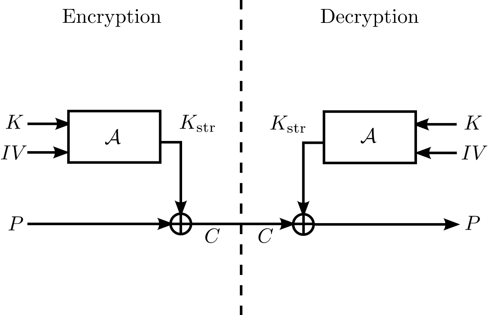

## Introduction
Moustique is a Self-synchronizing stream cipher which was broken in the final round of the eStream project. Here we present it's the reduced size analog.

Team Members: [Param Rathour](http://paramrathour.github.io/), [Prathamesh Dhake](https://github.com/I-9028)

- [Report](Moustique_Cipher.pdf)
- [Code (Notebook)](Stream%20Cipher%20Generation.ipynb)
- [Code (.py)](Stream%20Cipher%20Generation.py)

## Stream Cipher
